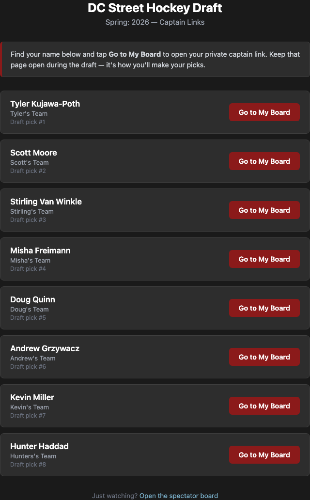
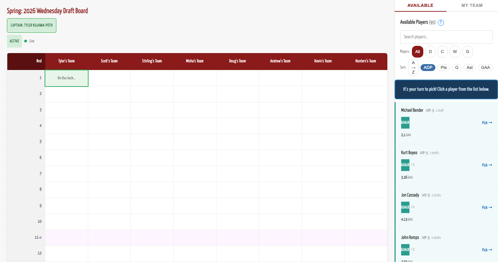
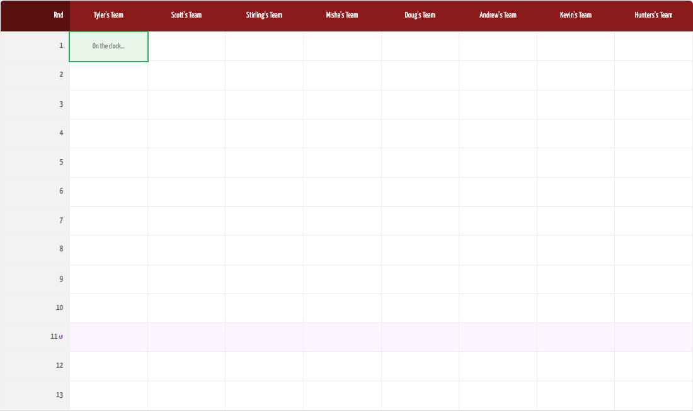
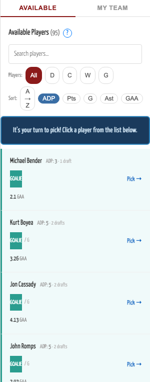
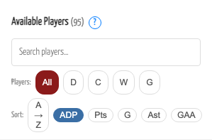
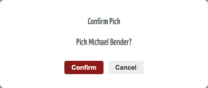
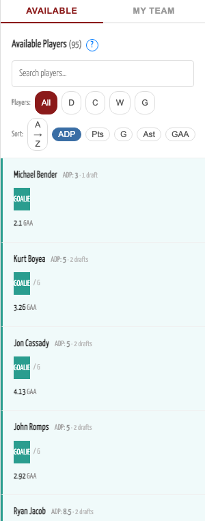
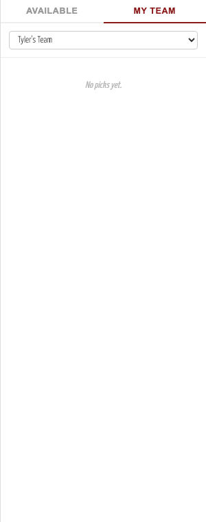

# DC Street Hockey — Wednesday Draft Board: Captain's Guide

This guide walks you through the online draft board from a captain's perspective. The board is live — all captains see the same state in real time, picks appear instantly, and you never need to reload the page.

---

## 1. Getting Your Link

The commissioner will share a **Captain Portal** page before draft day. Open it, find your name, and click **Go to My Board**.



Your board link is unique to you and is the only way to submit picks. **Bookmark it or keep the tab open throughout the draft.** If you lose the link, contact the commissioner.

> Want to watch on a second screen? The commissioner will also share a public **spectator link** — it shows the same board in read-only mode, no login needed.

---

## 2. The Board at a Glance

Once you open your captain link you'll see two panels side by side:



| Panel | What it is |
|---|---|
| **Left — Draft Grid** | One column per team, one row per round. Fills in as picks are made. |
| **Right — Player Pool** | Every undrafted player. This is where you browse and pick from. |

At the top left you'll see your **role badge** ("Captain: Your Name"), the **draft state** (Setup / Draw / Active / Paused / Complete), and a **Live** connection indicator.

---

## 3. The Draft Grid



- Each **column** is a team. Your column is highlighted in green when it's your turn.
- Each **row** is a round of the snake draft.
- The active cell shows **"On the clock…"** for whoever is currently picking.
- **Round 11** has a tinted background — pick order is re-randomized for that round (see [Round 11](#8-round-11-re-draw) below).

---

## 4. The Player Pool

The right panel is your workspace for browsing and picking players.



### Tabs

| Tab | Shows |
|---|---|
| **Available** | Every player not yet drafted |
| **My Team** | Players you've already picked |

### Search

Type any part of a name in the search box to filter the list instantly.

### Position Filters

**All · D · C · W · G** — filter by primary position (Defense, Center, Wing, Goalie).

> Goalies appear with a teal **GOALIE** badge. Once your team already has a goalie, all remaining goalies are dimmed and un-clickable.

### Sort Options



| Button | Sorts by |
|---|---|
| **ADP** *(default)* | Average Draft Round — lower = historically picked earlier |
| **A → Z** | Alphabetical by last name |
| **Pts** | Points per season (Wednesday Draft history only) |
| **G** | Goals per season |
| **Ast** | Assists per season |
| **GAA** | Goals Against Average (goalies only) |

### Reading a Player Card

```
Last, First                  ADP: 3 · 1 draft
GOALIE                                  Pick →
2.1 GAA
```

- **ADP** — the average round this player was drafted in past Wednesday seasons. "1 draft" means one season of data. "––" means no history (new player).
- **Stats** are per-season averages from **Wednesday Draft League games only**.
- *New to league* in italics = no recorded Wednesday Draft history.
- Goalies show **GAA**; all other players show Goals, Assists, Points.
- The **Pick →** button only appears when it's your turn.

> **Tip:** Sort by ADP first to see who has historically been drafted early. It's a great starting point when evaluating players you don't know personally.

---

## 5. When It's Your Turn

When the draft reaches your pick, a bright blue banner appears above the player list:


> **It's your turn to pick! Click a player from the list below.**

Every player card also reveals a **Pick →** button on the right. Click any player to start the pick.

---

## 6. Making a Pick

1. **Click a player's name or "Pick →"** when the blue banner is showing.
2. A confirmation dialog appears:



3. Click **Confirm** to lock in the pick, or **Cancel** to go back to the list.

The pick appears on the board grid immediately and is removed from the Available list for everyone.

> **Picks cannot be self-undone.** If you accidentally draft the wrong player, contact the commissioner right away — they have an undo button.

---

## 7. When It's Not Your Turn

You can browse and plan freely between your picks — search, filter, sort, and read player cards. Clicking a player has no effect when it isn't your turn (no confirmation dialog will appear).



---

## 8. Your Captain Auto-Pick Round

Each captain has one round where **they are automatically drafted onto their own team**. You don't need to do anything — when the draft reaches your designated round and it's your team's pick, the system fires the pick instantly.

You'll see your name appear in your team's column with a gold **CAPTAIN** badge. The panel will show:

> **You're being drafted onto your team this round — sit tight!**

The commissioner will confirm your captain round before the draft starts.

---

## 9. Round 11 Re-Draw

Round 11 is special: pick order for that round is **re-randomized**, independent of draft position. When the draft enters round 11, a full-screen reveal overlay shows the new order. After the reveal, the snake format resumes from round 12 based on regular draft position.

You don't need to do anything — just watch the overlay and wait for your cell to be highlighted.

---

## 10. Tracking Your Team

Click the **My Team** tab at any point to see all the players you've drafted so far.



You can switch back to **Available** at any time without losing your place.

---

## 11. Staying Connected

The board uses a live WebSocket connection. The **Live** dot in the status bar stays green as long as you're connected.

If you lose connection (network hiccup, phone lock, tab backgrounded), the dot turns gray and shows **Reconnecting…** — the page retries automatically. You don't need to reload.

If you do reload, just re-open your original captain link. The full board state is preserved on the server.

---

## Quick Reference

| Situation | What to do |
|---|---|
| Blue banner appears | It's your turn — click a player, then Confirm |
| Browsing between turns | Search, filter, and sort freely |
| Captain round comes up | Nothing — auto-pick fires automatically |
| Wrong pick made | Contact the commissioner immediately |
| Lost connection | Wait — reconnects automatically in seconds |
| Reloaded the page | Re-open your original captain link |
| Lost your link | Contact the commissioner |

---

## Draft Day Checklist

- [ ] Open your captain board link before the draft starts
- [ ] Confirm the green **Live** dot is showing
- [ ] Watch the position draw overlay to see your draft slot
- [ ] Know which round is your captain auto-pick round
- [ ] Keep the tab open for the entire draft
